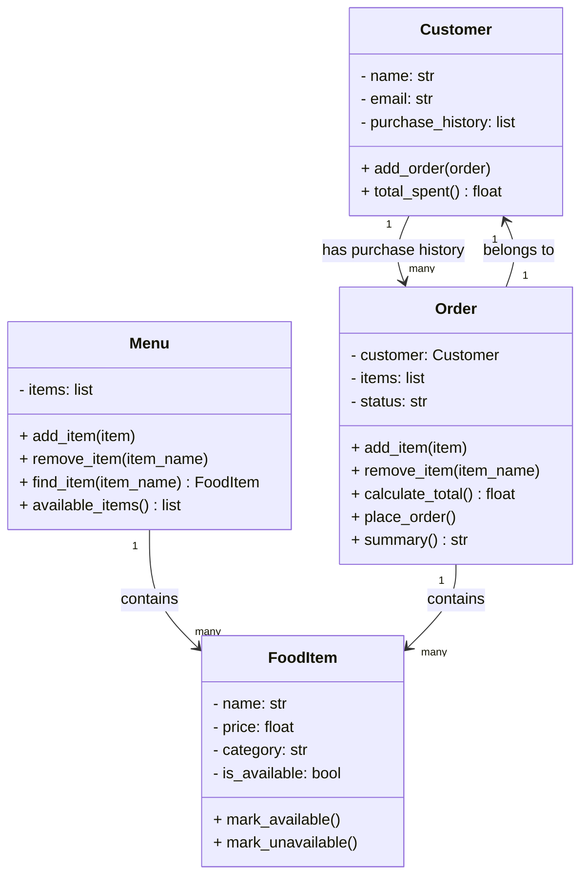

# ByteBites Design Document

## Project Overview

ByteBites is a campus food-ordering system. The system lets customers browse food items, choose items from a menu, create an order, calculate the total cost, and save the order to the customer's purchase history.

The purpose of this design is to reason about the system before writing Python code. The project uses four classes only:

1. `Customer`
2. `FoodItem`
3. `Menu`
4. `Order`

The design uses composition instead of inheritance. None of these classes should inherit from each other because they are not "is-a" relationships. For example, an `Order` is not a `Customer`, and a `FoodItem` is not a `Menu`.

---

## Class Responsibilities

### 1. Customer

**One-sentence description:**  
A `Customer` stores a customer's identity and purchase history.

**Attributes:**

- `name`: the customer's name
- `email`: the customer's email address
- `purchase_history`: a list of completed orders

**Responsibilities:**

- Store customer information
- Track completed orders
- Calculate how much the customer has spent over time

**What this class should not do:**

- It should not manage the menu
- It should not calculate inventory
- It should not decide restaurant pricing

---

### 2. FoodItem

**One-sentence description:**  
A `FoodItem` stores information about one menu item that can be ordered.

**Attributes:**

- `name`: the food item's name
- `price`: the food item's price
- `category`: the type of food, such as entree, drink, or dessert
- `is_available`: whether the item can currently be ordered

**Responsibilities:**

- Store item name, price, category, and availability
- Mark an item as available or unavailable
- Represent one item that can appear on a menu or inside an order

**What this class should not do:**

- It should not store customer information
- It should not manage the whole menu
- It should not complete an order

---

### 3. Menu

**One-sentence description:**  
A `Menu` stores and manages the food items that are available for customers to order.

**Attributes:**

- `items`: a list of `FoodItem` objects

**Responsibilities:**

- Add food items
- Remove food items
- Find food items by name
- Show available food items

**What this class should not do:**

- It should not track customer purchase history
- It should not process orders
- It should not become a separate `MenuManager` class unless the project grows much larger

---

### 4. Order

**One-sentence description:**  
An `Order` stores the customer, selected food items, order status, and total cost.

**Attributes:**

- `customer`: the `Customer` who placed the order
- `items`: a list of ordered `FoodItem` objects
- `status`: the current order status, such as `"cart"`, `"placed"`, or `"cancelled"`

**Responsibilities:**

- Add available food items to the order
- Remove food items from the order
- Calculate the total price
- Place the order
- Add the completed order to the customer's purchase history

**What this class should not do:**

- It should not own the entire menu
- It should not create unrelated classes
- It should not inherit from `Customer`

---

## UML Class Diagram

---

## Relationship Explanation

The design mostly uses "has-a" relationships:

- A `Menu` has many `FoodItem` objects.
- An `Order` has one `Customer`.
- An `Order` has many `FoodItem` objects.
- A `Customer` has many past `Order` objects in purchase history.

This is why inheritance would be the wrong design choice. A `FoodItem` is not a `Menu`; it belongs inside a menu. An `Order` is not a `Customer`; it is connected to a customer.

---

## Prompt → Critique → Refine Notes

### Prompt

I asked the AI to design a campus food-ordering system using exactly four classes: `Customer`, `FoodItem`, `Menu`, and `Order`. I asked it to use composition instead of inheritance and to avoid adding extra manager classes.

### Critique

A possible AI mistake would be adding unnecessary classes like `MenuManager`, `PaymentProcessor`, or `Restaurant`. Those classes might make sense in a larger real-world system, but they are outside the current project scope. Another possible mistake would be using inheritance, such as making `FoodItem` inherit from `Menu`, which would be incorrect because a food item is not a menu.

### Refine

The final design keeps only the four required classes. Each class has a clear responsibility, and the relationships are based on composition. The code should match this design before adding any extra features.
